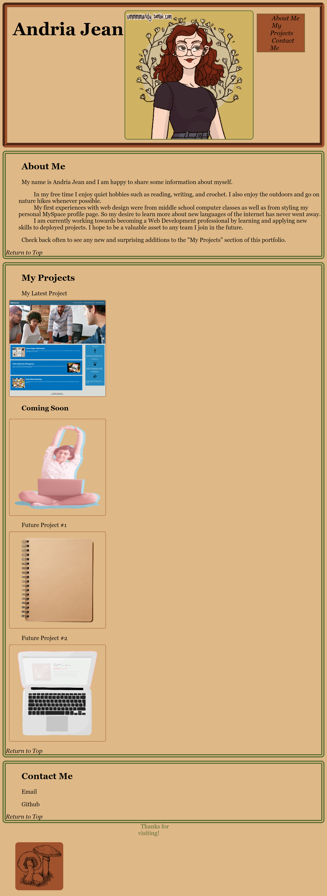

# Professional-Portfolio
Portfolio of current and upcoming samples of professional work

## Description
This portfolio is a work in progress intended to showcase skills learned and applied in a professional manner. As new skills are acquired and projects completed, this portfolio will continue to grow in content and style. Check back to see how robust this portfolio becomes with time.

## Authors and Credits
Sourcecode created and edited by Andria Jean

Profile Picture created on picrew.me/en by original artist found here:  https://ummmmandy.tumblr.com/

All other images sourced by RawPixel.com (creative commons licensing) 

## Version History
1.0     Created 10/24/2023 Completed 10/30/2023

Future versions will be updated as more examples of professional work become available.

## Mock Up

## License
MIT License

Copyright (c) 2023 EowynStark

Permission is hereby granted, free of charge, to any person obtaining a copy
of this software and associated documentation files (the "Software"), to deal
in the Software without restriction, including without limitation the rights
to use, copy, modify, merge, publish, distribute, sublicense, and/or sell
copies of the Software, and to permit persons to whom the Software is
furnished to do so, subject to the following conditions:

The above copyright notice and this permission notice shall be included in all
copies or substantial portions of the Software.

THE SOFTWARE IS PROVIDED "AS IS", WITHOUT WARRANTY OF ANY KIND, EXPRESS OR
IMPLIED, INCLUDING BUT NOT LIMITED TO THE WARRANTIES OF MERCHANTABILITY,
FITNESS FOR A PARTICULAR PURPOSE AND NONINFRINGEMENT. IN NO EVENT SHALL THE
AUTHORS OR COPYRIGHT HOLDERS BE LIABLE FOR ANY CLAIM, DAMAGES OR OTHER
LIABILITY, WHETHER IN AN ACTION OF CONTRACT, TORT OR OTHERWISE, ARISING FROM,
OUT OF OR IN CONNECTION WITH THE SOFTWARE OR THE USE OR OTHER DEALINGS IN THE
SOFTWARE.
